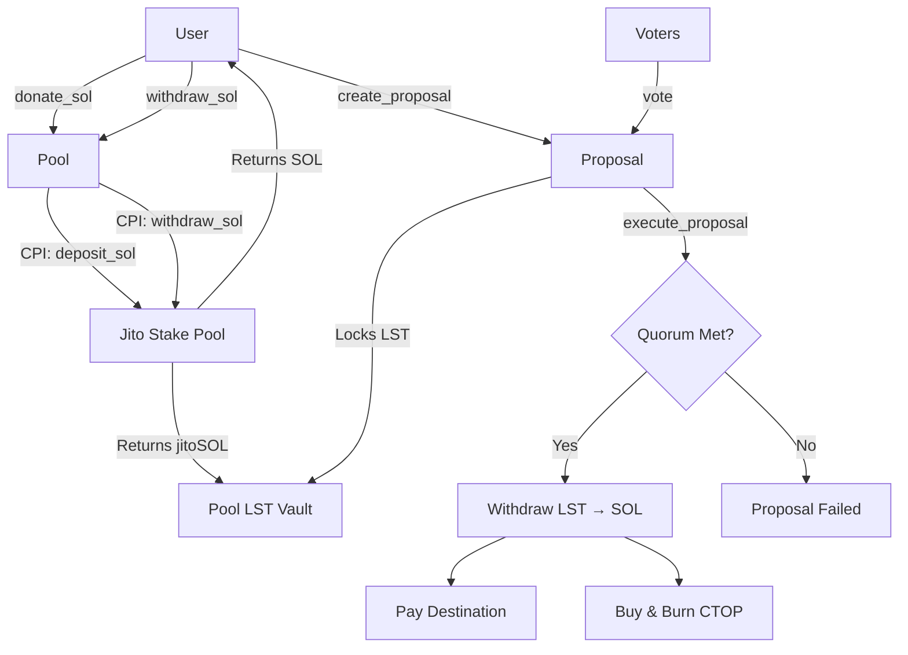

# 🏦 CTO Pools

[](https://solana.com/)
[](https://www.anchor-lang.com/)
[](LICENSE)
[](https://www.rust-lang.org/)

> A fully staked, governance-controlled treasury system for decentralized Community Takeover (CTO) funding on Solana.

---

## 📑 Table of Contents

- [Overview](#-overview)
- [Features](#-features)
- [Architecture](#-architecture)
- [Getting Started](#-getting-started)
- [Program Instructions](#-program-instructions)
- [Account Structures](#-account-structures)
- [PDA Derivations](#-pda-derivations)
- [Configuration](#%EF%B8%8F-configuration)
- [Security](#-security)
- [Networks](#-networks)
- [License](#-license)
- [Contributing](#-contributing)

---

## 🌟 Overview

**CTO Pools** is a decentralized funding mechanism built on Solana that enables community-led revivals of abandoned token projects. The protocol operates as a **fully staked treasury system** where all pool value is stored as Liquid Staking Tokens (LST), specifically jitoSOL, ensuring continuous yield generation.

### Key Concepts

- **Community Takeover (CTO)**: A grassroots effort to revive abandoned token projects through community governance
- **Fully Staked Model**: All deposited SOL is immediately converted to LST (jitoSOL), maximizing capital efficiency
- **Governance-Controlled**: Proposals require community consensus with built-in anti-manipulation safeguards
- **No Long-Term SOL Custody**: Native SOL exists only transiently during withdrawals and proposal execution

---

## ✨ Features

### 💰 Treasury Management
- **One Pool Per Token**: Each token mint gets a dedicated treasury pool
- **Share-Based Ownership**: Proportional ownership via share tokens for fair representation
- **Automatic Yield**: All funds earn staking rewards through jitoSOL

### 🗳️ Governance System
- **30% Quorum Requirement**: Ensures meaningful community participation
- **20% Voting Cap**: Prevents whale domination of governance
- **24-Hour Voting Period**: Balanced timeframe for participation
- **Single Active Proposal**: Prevents governance spam

### 💸 Fee Allocation
- **Protocol Fee on Withdrawals**: 1% (The only fee charged by the platform)
- **🔥 Buy & Burn**: Half of protocol fees used for CTOP token buy & burn
- **Developer Fund**: Half of protocol fees allocated for ongoing development and maintenance

### 🔄 Buy & Burn Mechanics
- **Raydium Integration**: Automated swaps via Raydium AMM
- **Deflationary Pressure**: Continuous reduction of CTOP supply

### 🛡️ Security Features
- **Single Donor Prevention**: Prevents self-dealing attacks
- **Holding Delay**: Non-creators must wait before proposing
- **Stake Pool Validation**: Only allows verified Jito stake pools
- **Fund Recovery Governance**: Democratic process to recover accidentally sent tokens

---

## 🏗 Architecture

```
┌─────────────────────────────────────────────────────────────────────┐
│                         CTO Pools Program                           │
├─────────────────────────────────────────────────────────────────────┤
│                                                                      │
│  ┌──────────────┐    ┌──────────────┐    ┌──────────────┐          │
│  │   Pool       │    │   Donor      │    │  Proposal    │          │
│  │   Account    │◄───│   Account    │───►│   Account    │          │
│  └──────┬───────┘    └──────────────┘    └──────┬───────┘          │
│         │                                        │                   │
│         │           ┌──────────────┐            │                   │
│         └──────────►│   LST Vault  │◄───────────┘                   │
│                     │  (jitoSOL)   │                                │
│                     └──────┬───────┘                                │
│                            │                                         │
├────────────────────────────┼────────────────────────────────────────┤
│                            ▼                                         │
│              ┌─────────────────────────┐                            │
│              │   Jito Stake Pool       │                            │
│              │   (External Program)    │                            │
│              └─────────────────────────┘                            │
│                                                                      │
│              ┌─────────────────────────┐                            │
│              │   Raydium AMM           │                            │
│              │   (Buy & Burn)          │                            │
│              └─────────────────────────┘                            │
└─────────────────────────────────────────────────────────────────────┘
```

### Flow Diagram



---

## 🚀 Getting Started

### Prerequisites

Ensure you have the following installed:

| Tool | Version | Installation |
|------|---------|--------------|
| Rust | 1.75+ | [rustup.rs](https://rustup.rs/) |
| Solana CLI | 1.18+ | [Solana Docs](https://docs.solana.com/cli/install-solana-cli-tools) |
| Anchor | 0.32.1 | [Anchor Book](https://www.anchor-lang.com/docs/installation) |

### Installation

1. **Clone the repository**
   ```bash
   git clone https://github.com/your-org/cto-pools.git
   cd cto-pools/programs/cto_pools
   ```

2. **Install dependencies**
   ```bash
   cargo build
   ```

3. **Configure Solana CLI**
   ```bash
   # For devnet
   solana config set --url devnet
   
   # For mainnet
   solana config set --url mainnet-beta
   ```

### Building the Program

```bash
# Build the program
anchor build

# Run tests
anchor test

# Deploy to devnet
anchor deploy --provider.cluster devnet

# Deploy to mainnet (requires sufficient SOL)
anchor deploy --provider.cluster mainnet
```

### Local Development

```bash
# Start local validator with Jito stake pool
solana-test-validator --clone SPoo1Ku8WFXoNDMHPsrGSTSG1Y47rzgn41SLUNakuHy

# Build and deploy locally
anchor build
anchor deploy
```

---

## 📋 Program Instructions

### Core Operations

| Instruction | Description | Access |
|-------------|-------------|--------|
| `create_pool` | Creates a new treasury pool for a token mint with LST configuration | Anyone |
| `donate_sol` | Deposits SOL which is immediately staked, donor receives pool shares | Anyone |
| `withdraw_sol` | Converts LST back to SOL and returns to donor proportional to shares | Donors |

### Governance Operations

| Instruction | Description | Access |
|-------------|-------------|--------|
| `create_proposal` | Creates a governance payout proposal with LST locking | Qualified Donors |
| `vote` | Cast or change vote (Yes/No/Abstain) on an active proposal | Donors |
| `execute_proposal` | Executes proposal after voting period if quorum is met | Anyone |

### Configuration Operations

| Instruction | Description | Access |
|-------------|-------------|--------|
| `configure_raydium_pool` | Configures Raydium pool address for buy & burn functionality | Pool Authority |

### Recovery Operations

| Instruction | Description | Access |
|-------------|-------------|--------|
| `recover_funds_create` | Creates recovery proposal for accidentally sent tokens (non-LST only) | Qualified Donors |
| `recover_funds_vote` | Vote on a recovery proposal | Donors |
| `recover_funds_execute` | Executes recovery proposal after voting period | Anyone |

---

## 📦 Account Structures

### Pool Account

The main treasury account for each token. Stores configuration, share totals, and LST balances.

```rust
pub struct Pool {
    pub token_mint: Pubkey,              // The token this pool serves
    pub authority: Pubkey,               // Pool authority PDA
    pub creator: Pubkey,                 // Original pool creator
    pub total_shares: u64,               // Total shares issued to all donors
    pub total_pool_tokens: u64,          // LST tokens held (jitoSOL balance)
    pub reserved_pool_tokens: u64,       // LST locked for active proposals
    pub total_spent_lamports: u64,       // Historical spend tracking
    pub protocol_fee_bps: u16,           // Protocol fee (100 = 1%)
    pub quorum_bps: u16,                 // Required quorum (3000 = 30%)
    pub min_proposer_deposit_lamports: u64, // Minimum deposit to propose
    pub dev_fee_wallet: Pubkey,          // Development fee destination
    pub burn_token_mint: Pubkey,         // CTOP token for buy & burn
    pub active_proposal: Option<Pubkey>, // Current active proposal
    pub proposal_count: u64,             // Total proposals created
    pub active_recovery: Option<Pubkey>, // Current active recovery
    pub recovery_count: u64,             // Total recoveries created
    pub stake_pool_program: Pubkey,      // Jito stake pool program
    pub stake_pool: Pubkey,              // Stake pool address
    pub lst_mint: Pubkey,                // LST mint (jitoSOL)
    pub raydium_pool_id: Pubkey,         // Raydium pool for buy&burn
    pub raydium_enabled: bool,           // Whether Raydium is configured
}
```

### Donor Account

Tracks individual donor contributions and share ownership.

```rust
pub struct Donor {
    pub pool: Pubkey,                    // Associated pool
    pub wallet: Pubkey,                  // Donor's wallet address
    pub shares: u64,                     // Share balance
    pub total_deposited_lamports: u64,   // Total SOL deposited historically
    pub last_shares_change_slot: u64,    // Slot of last share change (for delay)
}
```

### Proposal Account

Represents a governance proposal for fund disbursement.

```rust
pub struct Proposal {
    pub pool: Pubkey,                    // Associated pool
    pub kind: ProposalKind,              // Type of proposal
    pub requested_lamports: u64,         // Amount requested in SOL
    pub destination_wallet: Pubkey,      // Recipient address
    pub title: String,                   // Proposal title (max 64 bytes)
    pub description: String,             // Proposal description (max 256 bytes)
    pub created_at_ts: i64,              // Creation timestamp
    pub deadline_ts: i64,                // Voting deadline (+24 hours)
    pub snapshot_slot: u64,              // Snapshot slot for voting weights
    pub total_snapshot_shares: u64,      // Total shares at snapshot
    pub locked_pool_tokens: u64,         // LST locked for this proposal
    pub yes_weight: u64,                 // Yes votes weight
    pub no_weight: u64,                  // No votes weight
    pub abstain_weight: u64,             // Abstain votes weight
    pub participation_weight: u64,       // Total participation weight
    pub status: ProposalStatus,          // Active, Failed, or Executed
}
```

### Vote Record Account

Records an individual vote on a proposal.

```rust
pub struct VoteRecord {
    pub proposal: Pubkey,                // Associated proposal
    pub voter: Pubkey,                   // Voter's wallet
    pub weight: u64,                     // Capped voting weight
    pub choice: VoteChoice,              // Yes, No, or Abstain
}
```

---

## 🔑 PDA Derivations

Program Derived Addresses (PDAs) are used for deterministic account addressing.

| Account | Seeds | Description |
|---------|-------|-------------|
| Pool | `["pool", token_mint]` | Main treasury account per token |
| Donor | `["donor", pool, wallet]` | Individual donor record |
| Proposal | `["proposal", pool, proposal_count]` | Governance proposal |
| VoteRecord | `["vote", proposal, wallet]` | Individual vote record |
| Recovery | `["recovery", pool, recovery_count]` | Fund recovery proposal |
| Pool WSOL | `["pool_wsol", pool]` | Wrapped SOL token account |
| Pool CTOP | `["pool_ctop", pool]` | CTOP token account for burn |

### Example PDA Derivation (Rust)

```rust
// Derive Pool PDA
let (pool_pda, bump) = Pubkey::find_program_address(
    &[b"pool", token_mint.as_ref()],
    &program_id
);

// Derive Donor PDA
let (donor_pda, bump) = Pubkey::find_program_address(
    &[b"donor", pool.as_ref(), wallet.as_ref()],
    &program_id
);
```

---

## ⚙️ Configuration

### Protocol Constants

| Constant | Value | Description |
|----------|-------|-------------|
| `PROTOCOL_FEE_BPS` | 100 | 1% protocol fee on withdrawals |
| `QUORUM_BPS` | 3000 | 30% quorum required for proposals |
| `MIN_PROPOSER_DEPOSIT` | 1 SOL | Minimum deposit to create proposals |
| `MAX_VOTER_BPS` | 2000 | 20% maximum voting weight per wallet |
| `PROPOSAL_BUFFER_BPS` | 50 | 0.50% extra LST locked for rate fluctuations |
| `MAX_SLIPPAGE_BPS` | 1500 | 15% maximum slippage for Raydium swaps |
| `VOTING_PERIOD` | 24 hours | Duration proposals remain active |

### Jito Stake Pool Configuration

#### Mainnet

```rust
JITO_MAINNET_STAKE_POOL_PROGRAM: SPoo1Ku8WFXoNDMHPsrGSTSG1Y47rzgn41SLUNakuHy
```

#### Devnet

```rust
JITO_DEVNET_STAKE_POOL_PROGRAM: DPoo15wWDqpPJJtS2MUZ49aRxqz5ZaaJCJP4z8bLuib
JITO_DEVNET_STAKE_POOL: JitoY5pcAxWX6iyP2QdFwTznGb8A99PRCUCVVxB46WZ
JITO_DEVNET_JITOSOL_MINT: J1tos8mqbhdGcF3pgj4PCKyVjzWSURcpLZU7pPGHxSYi
```

---

## 🔒 Security

### Anti-Manipulation Measures

| Measure | Description |
|---------|-------------|
| **Single Donor Prevention** | If `total_shares == donor.shares`, the donor cannot create proposals. This prevents a single contributor from self-dealing. |
| **Holding Delay** | Non-creator donors must wait `MIN_PROPOSAL_DELAY_SLOTS` after their last share change before proposing. |
| **Voting Cap** | Maximum 20% voting weight per wallet, regardless of actual share ownership. |
| **Single Active Proposal** | Only one proposal can be active at a time per pool. |
| **LST Recovery Prevention** | The pool's backing LST (jitoSOL) cannot be recovered through the recovery mechanism. |

### Stake Pool Validation

The program validates that only approved Jito stake pools are used:

- Mainnet: `SPoo1Ku8WFXoNDMHPsrGSTSG1Y47rzgn41SLUNakuHy`
- Devnet: `DPoo15wWDqpPJJtS2MUZ49aRxqz5ZaaJCJP4z8bLuib`

### Error Handling

The program includes 24 custom error types for comprehensive error handling:

```rust
// Math & Validation Errors
MathOverflow              // Arithmetic overflow detected
ZeroAmount                // Amount cannot be zero

// Share & Withdrawal Errors
NoShares                  // Donor has no shares
InsufficientWithdrawable  // Not enough withdrawable balance

// Proposal Errors
ActiveProposalExists      // A proposal is already active
ProposalNotActive         // Proposal has ended or been executed
SingleDonorCannotPropose  // Single donors cannot create proposals

// Stake Pool Errors
StakePoolCpiFailed        // CPI to stake pool failed
InvalidStakePoolConfig    // Invalid stake pool configuration

// Recovery Errors
RecoveryNotAllowedForLST  // Cannot recover pool's backing LST
```

---

## 🌐 Networks

### Program IDs

| Network | Version | Program ID |
|---------|---------|------------|
| **Mainnet** | V2 (Current) | `4T9SkpDeDyC8KWKrcGsVQ6wG14H46og6f9pBFNc1Csje` |
| **Mainnet** | V1 (Deprecated) | `GEZjJhN2DFWBaRMoTYM8JRKdyMYyMjYsG4Ag5LyEMJ2` |
| **Devnet** | V2 | Use Anchor deploy with devnet config |

### Version Differences

| Feature | V1 | V2 |
|---------|----|----|
| Storage | Native SOL | LST (jitoSOL) |
| Yield | None | Continuous staking rewards |
| Buy & Burn | Not available | 50% of fees |
| Fund Recovery | Not available | Governance-based |

---

## 📄 License

This project is licensed under the MIT License - see the [LICENSE](LICENSE) file for details.

---

## 🤝 Contributing

We welcome contributions to CTO Pools! Please follow these steps:

1. **Fork the repository**
2. **Create a feature branch**
   ```bash
   git checkout -b feature/your-feature-name
   ```
3. **Make your changes** following the coding standards
4. **Write or update tests** as needed
5. **Run tests** to ensure everything passes
   ```bash
   anchor test
   ```
6. **Submit a pull request** with a clear description

### Development Guidelines

- Follow Rust and Anchor best practices
- Write comprehensive tests for new features
- Update documentation for any API changes
- Use meaningful commit messages

### Reporting Issues

If you find a bug or have a feature request, please [open an issue](https://github.com/your-org/cto-pools/issues) with:

- Clear description of the problem or feature
- Steps to reproduce (for bugs)
- Expected vs actual behavior
- Relevant logs or screenshots

---

<p align="center">Built with ❤️ on Solana</p>
